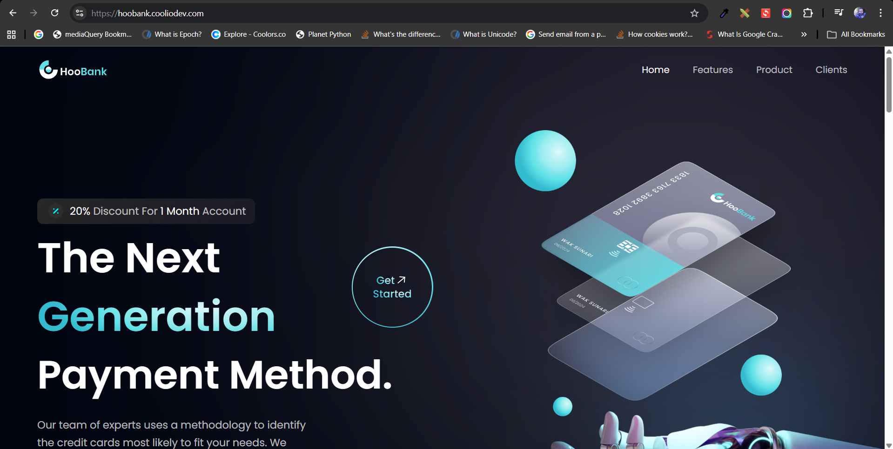
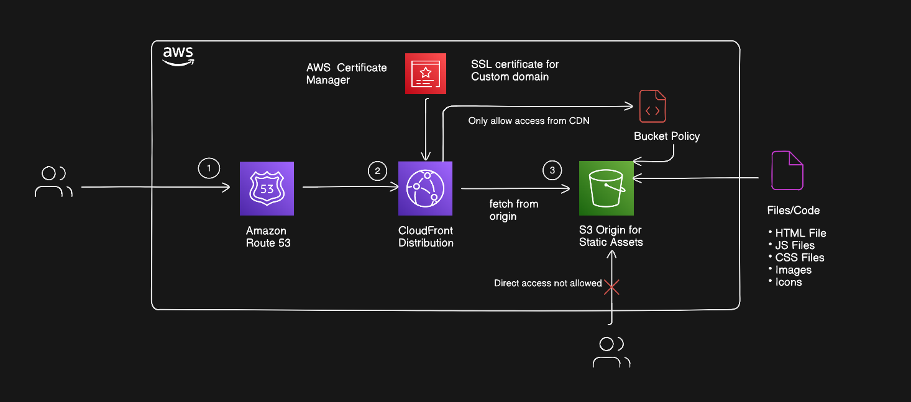
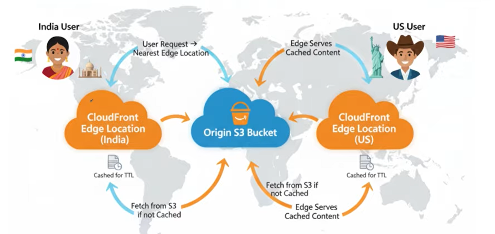

## 
🌐 Production-Ready React App on AWS using Terraform 

### 📌 Project Overview:

This project demonstrates the end-to-end deployment of a production-ready React application on AWS using Terraform as Infrastructure as Code. The application is hosted on Amazon S3 for static asset storage and served globally through Amazon CloudFront for low-latency content delivery and HTTPS support. Terraform is used to provision and manage all AWS resources in a repeatable, version-controlled manner, showcasing best practices in cloud infrastructure automation, scalability, and security. This project highlights practical DevOps skills, including AWS architecture design, infrastructure automation, and modern frontend deployment workflows.

---

### Live Demo:

---

### Architecture Diagram:

---

### ⚖️ Design Decisions:

As you know, we have multiple solutions for the same problem. We can use different services on AWS to deploy this application. We should architect our project based on the requirements we are given.

<strong>Amazon S3:</strong> Amazon S3 is used to host the React application’s static assets. Since the application is a static frontend, S3 allows us to store and serve files without provisioning or managing any underlying servers. S3 is highly scalable and highly available by design, automatically replicating data across multiple facilities to ensure durability and reliability. This makes it an ideal choice for storing frontend build artifacts.

<strong>Amazon CloudFront:</strong> While S3 supports static website hosting, serving a frontend application directly from S3 is not recommended for production use in terms of security, performance, and cost optimisation. S3 does not natively support custom domains with HTTPS when used alone, and high request volumes can lead to increased costs, as pricing scales linearly with the number of requests and data transfer.

Amazon CloudFront addresses these limitations by acting as a global Content Delivery Network (CDN) in front of S3. CloudFront caches application assets at edge locations closest to users, significantly reducing latency for a globally distributed audience. It also enables secure access via HTTPS, supports custom domain names, reduces direct load on S3, and helps optimise costs by minimising repeated origin requests. This combination ensures fast, secure, and scalable delivery of the application to users worldwide.

---

### 🚀 Key Features:

- React application deployed as static assets to Amazon S3  
- Global content delivery using Amazon CloudFront (CDN)  
- HTTPS enabled using AWS Certificate Manager (ACM)  
- Custom domain configuration with Amazon Route 53  
- Secure access between CloudFront and S3 (restricted origin access)  
- Infrastructure provisioning using Terraform (Infrastructure as Code)  
- Remote Terraform state management using Amazon S3 with locking

---

### 🚧 Challenges:

- Debugged and fixed the S3 bucket policy syntax issues by changing the Principal component value.
- Resolved Terraform state conflicts across teams by using remote state locking
- Reused existing ACM certificate through Terraform data sources

---

### 🎯 Learning Objectives:

- Understand how to deploy and host a React application using AWS S3 and CloudFront
- Learn how to design globally available frontend architectures using a CDN
- Gain hands-on experience with Terraform for Infrastructure as Code (IaC)
- Implement secure access patterns between CloudFront and S3

---

### 👨‍💻 Connect with me:

**Ibrar Munir**

Github: https://github.com/ibrarmunircoder  
LinkedIn: https://www.linkedin.com/in/ibrar-munir-53197a16b   
Portfolio: https://ibrarmunir.d3psh89dj43dt6.amplifyapp.com
